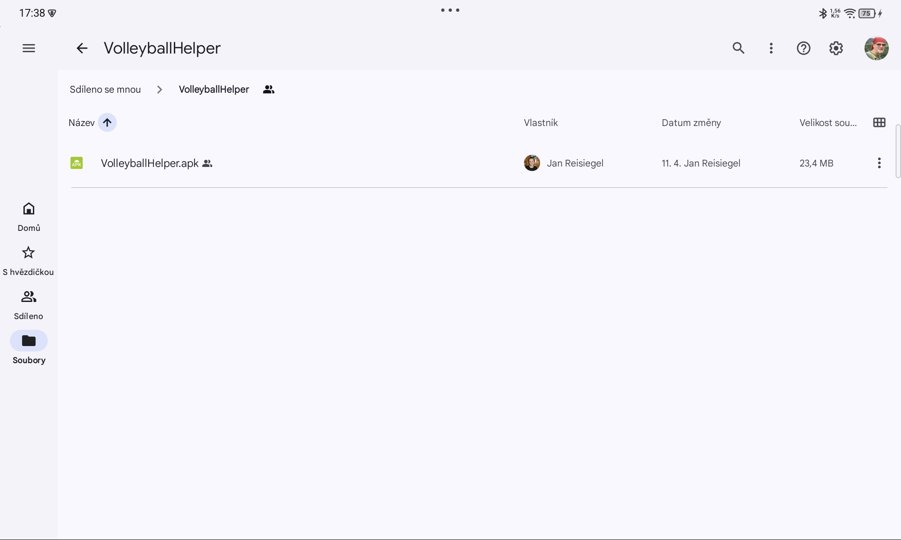
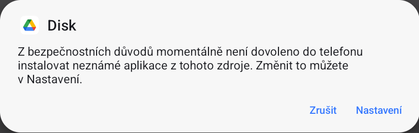
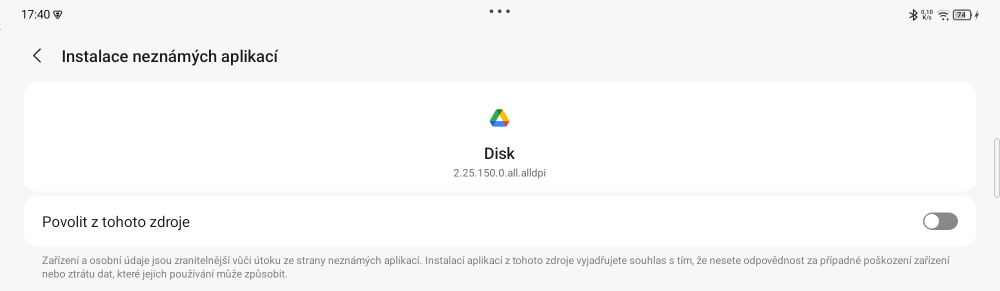
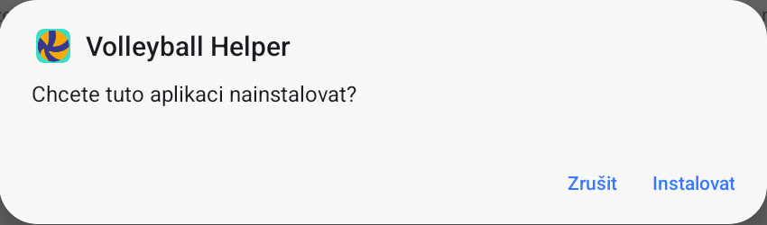
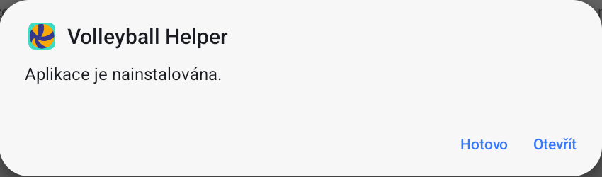
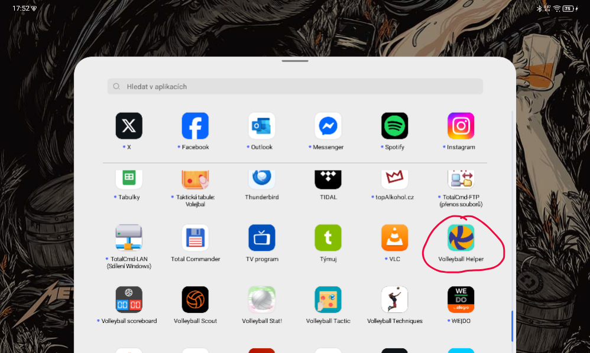

# Volleyball Helper

1. Na zařízení si otevřete [Google Disk obsahující aplikaci](https://drive.google.com/drive/folders/1qBreCl1PCioz76EheR9vFgp6NGdwoZiV?usp=sharing)
2. Po otevření se zobrazí složka s aplikací
   
3. Klikněte na APO soubor
4. Pokud máte povolené instalování aplikací třetích stran pro aplikaci Google Disk, přeskočte na bod 7.
5. Pokud nemáte povolené instalování aplikací třetích stran zobrazí se dialog:
   
6. Klikněte na nastavení. Zobrazí se Vám Nastavení oprvávnění oeračního systému:
   
7. Klikněte na přepínací tlačítko
8. Zobrazil se vám dialog. Klikněte na **Instalovat**
   
9. Po instalaci se zobrazí dialog, že je aplikace nainstalována:
   
10. Kliknutím an **Otevřít** otevřete aplikaci Volleyball Helper. Jinak ji najdete mizi ostatními aplikacemi na zařízení:
    
